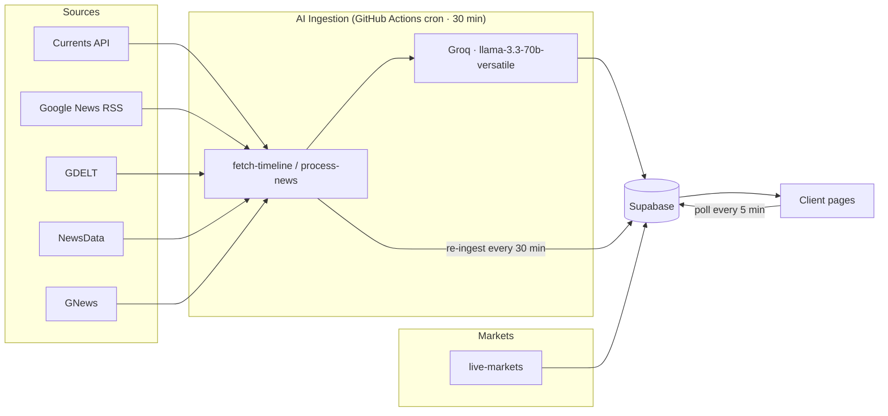

# ConflictSee

**Real-time Iran–Israel war intelligence dashboard** — timeline, economics, world affairs, and rumors, updated automatically from live news sources and AI-extracted conflict events.

Built and maintained by [Vyden Co.](https://vyden.co.in)

> **Live demo:** https://conflictsee1.vercel.app

## Contact

Questions, suggestions, or want to build something around ConflictSee? Reach us at **conflictsee@gmail.com**.

---

## What it does

ConflictSee aggregates news from five live sources, uses an LLM to extract structured conflict events, and presents them in four sections:

- **Timeline** — chronological conflict events with categories and verification status
- **Economics** — live oil/commodities/forex/stock markets and war-impact news
- **World Affairs** — country stances, military involvement, and world affairs news
- **Rumors** — unverified intel and rumor tracking with confidence ratings

## Architecture



- **Sources** (Currents, Google News RSS, GDELT, NewsData, GNews) feed the ingestion workflow.
- **Groq** (`llama-3.3-70b-versatile`) extracts structured events, filtering irrelevant content.
- **Supabase** stores events, prices, news, and market cache.
- **Client pages** poll Supabase every 5 minutes; **GitHub Actions** re-ingests every 30 minutes (free on any Vercel plan).

## Tech Stack

| Layer | Tech |
|---|---|
| Framework | [Next.js 14](https://nextjs.org) (App Router) |
| Styling | Tailwind CSS + custom `globals.css` design tokens |
| Database | Supabase (PostgreSQL) with Row-Level Security |
| AI ingestion | Groq (`llama-3.3-70b-versatile`) |
| News sources | Currents API, Google News RSS, GDELT, NewsData, GNews |
| Market data | Alpha Vantage, OilPrice API, ExchangeRate API |
| Fonts | Inter (all text), Space Mono (numbers/prices/times) |
| Deployment | Vercel (free plan) |

## Getting Started

### Prerequisites

- Node.js 18+
- A Supabase project
- Free-tier API keys (see below)

### Setup

```bash
# 1. Clone
git clone https://github.com/conflictsee-arch/conflictsee.git
cd conflictsee

# 2. Install dependencies
npm install

# 3. Configure environment
cp .env.example .env.local
# fill in your keys (see below)

# 4. Run
npm run dev
# open http://localhost:3000
```

### Supabase Schema

Create the tables listed in [`DETAILS.md`](DETAILS.md) (Supabase Tables section). Enable **Row-Level Security** on every table with a public `SELECT` policy only (`USING (true)`) — writes happen server-side via the service role key.

### Required API Keys (free tier)

All third-party services are **free-tier** and **will rate-limit** under load:

| Service | Env var | Used for | Free-tier limits |
|---|---|---|---|
| Supabase | `NEXT_PUBLIC_SUPABASE_URL`, `NEXT_PUBLIC_SUPABASE_ANON_KEY`, `SUPABASE_SERVICE_ROLE_KEY` | Database | ~200 concurrent connections |
| Groq | `GROQ_TIMELINE_KEY_1`, `GROQ_KEY_ORG_2`, `GROQ_KEY_ORG_3`, `GROQ_KEY_ORG_4` | AI ingestion | 100K tokens/day per org |
| Currents API | `CURRENTS_KEY` | Real-time news | ~250 req/day |
| NewsData | `NEWSDATA_KEY` | News fallback | ~12h delayed, `size=10` |
| GNews | `GNEWS_KEY` | News fallback | ~12h delayed, 100 req/day |
| Alpha Vantage | `ALPHAVANTAGE_KEY` | Market data | 25 req/day |
| ExchangeRate | `EXCHANGERATE_KEY` | Forex | limited |
| OilPrice API | `OILPRICE_KEY` | Oil/commodities | limited |
| Cron | `CRON_SECRET` | Secures internal routes | — |
| Sentry | `SENTRY_DSN`, `NEXT_PUBLIC_SENTRY_DSN` | Error monitoring | optional |

> See `AGENTS.md` (key-pool table) for how keys map to sections.

## Documentation

- `README.md` — this file (public overview)
- `AGENTS.md` — internal/agent instructions (key pools, design tokens, rules)
- `DETAILS.md` — full project documentation (architecture, API routes, schema)
- `CONTRIBUTING.md` — how to contribute
- `SECURITY.md` — vulnerability reporting
- `DEPLOY.md` — Vercel deployment checklist (maintainers)

## License

This project is licensed under the [MIT License](LICENSE) — © 2026 Vyden Co.

## Contributing

We welcome contributions! See [CONTRIBUTING.md](CONTRIBUTING.md) for guidelines, design-system rules, and how to open a PR.
